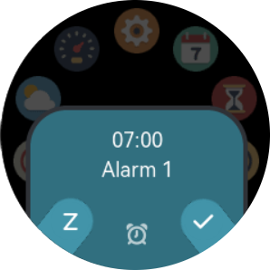

Alarms
================

The alarms behave similarly to alarms on phones. 

Snooze mode
---------------

With snooze mode on, the alarm will ring at set time for 10 minutes, followed by a 9 minute break, and repeat this pattern till next day (24 hours).

   Press left button for snooze, or right button to turn it off.

If snooze mode is disabled, it will ring at most 10 minutes then go off.

Repeat
----------------

You can select what days in the week you want the alarm to repeat. If none is selected, it becomes an one-off alarm.

.. important::
	Don't forget to hit the save button after alarm settings are changed

