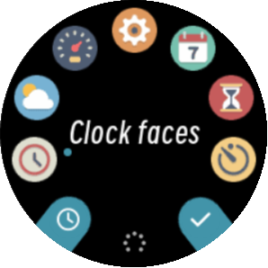
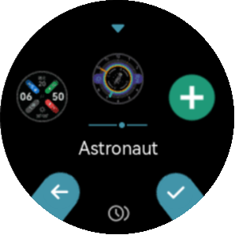
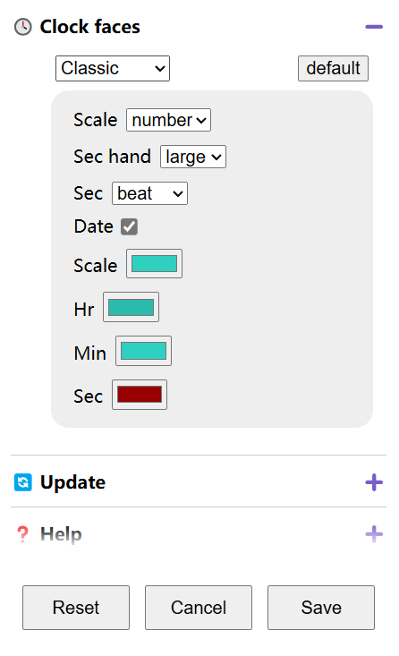
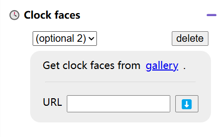
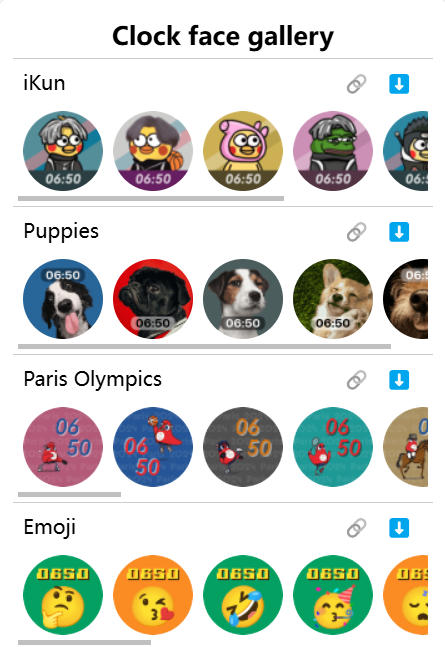

Clock Face customization
============================

   Go to "Clock faces" selection interface

   Choose from built-in clock faces and optional ones.

Built-in clock faces
--------------------------

| In settings web page, select relevant clock face from drop down menu. 
| Color or style of built-in clock faces are customizable.

\

Optional clock faces
-------------------------

Optional clock faces can be downloaded.

Select "optional N" from drop down menu. then click the "gallery" link

\

Download clock face of choice by clicking the ⬇️ button.

\

.. raw:: html

   

   <b>Video guide</b>
   <iframe src="https://www.bilibili.com/blackboard/html5mobileplayer.html?aid=1206308138&bvid=BV1Sf421q7bu&cid=1628971459&p=1&high_quality=1&danmaku=0" scrolling="no" border="0" frameborder="no" framespacing="0" allowfullscreen="true"></iframe>
   

