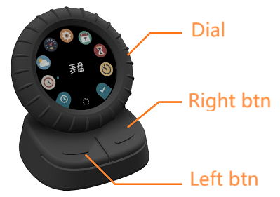
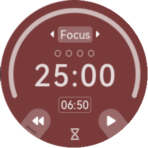
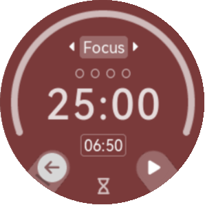

Dial and Buttons
==================

\   

| Usually the left button is denoted with ← icon, you can press it to go back to menu interface.
| In other caces, when special functions are assign to left button, to go back, you'll have to long press left button.

   In pomodoro, left button has reset icon ⏪

   It'll turn ← after long press