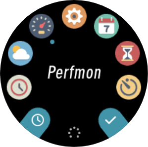
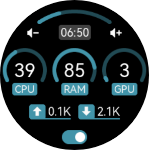

Perfmon
===============

The device can act as a simple performance monitor to show your PC's CPU/GPU/RAM usage and so.

   Select "Perfmon" in menu

   Press right buttton ⊙ to turn on/off perfmon server.

You also need to download and run a client software on your PC, which can periodically read and send performance data to device.

.. toctree::
   :maxdepth: 1

   perfmon_win
   perfmon_gen

.. warning::
   Currently only Windows is supported, more will come later.

