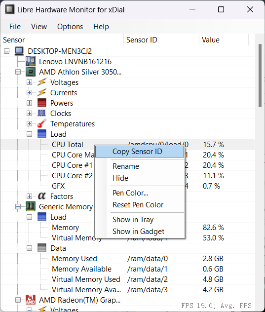
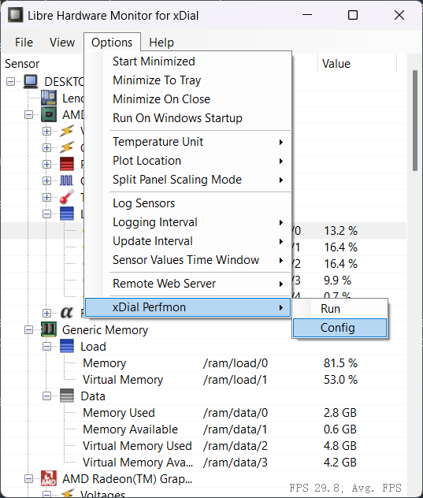
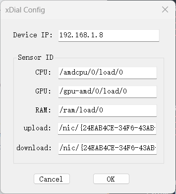
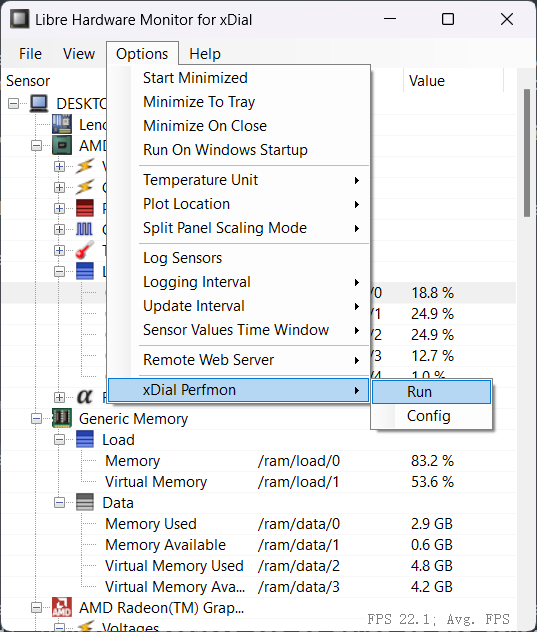

Perfmon for Windows
+++++++++++++++++++++++

Download :xref:`LibreHardwareMonitor_for_xDial.zip <https://github.com/r-cute/LibreHardwareMonitor_for_xDial/releases/latest>` on your PC, **unzip all** then double click LibreHardwareMonitor_for_xDial.exe

\

.. note::
   The software requires .NET 4.7.2 or later, for Win 7 and earlier systems, you may need to :xref:`download and install .NET Framework 4.7 Runtime <https://dotnet.microsoft.com/en-us/download/dotnet-framework/net47>`

From the *Optoins* menu, you can check *Run on Windows Startup* or *Minimize to Tray*, or set *Update Interval* to your preference.

Find CPU Load (CPU Total), right click on the line → select *Copy Sensor ID*

\

Click menu *Options* → *xDial Perfmon* → *config*

\

In the dialog window, paste it into the CPU textbox. Similarly, find and fill in other sensors' ID (or leave them blank if not needed), Device IP address can be found on the device's *Perfmon* interface, click *OK* button to confirm.

\

Click menu *Options* → *xDial Perfmon* → *config*, now the software will establish connection to device.

\

Also, make sure the device's perfmon server is turned on.

