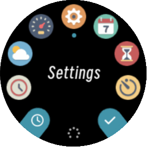
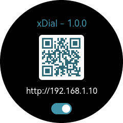
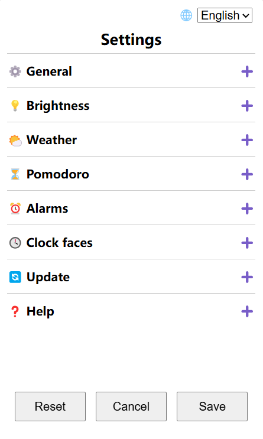

Settings
=============

   Select "Settings" in menu

   Press right buttton ⊙ to turn on/off settings server.

Go to the settings web page by scaning the QR code on your device or visiting the URL below it.

.. note::
   It's recommended to bind the device to a static IP address. Usually this can be done in the configurtion page of your WiFi router.

\

| You can expend sections by clicking the "+" sign, modify settings then click "Save" button at the bottom.
| Or you can mess around and click "Cancel" button before new settings are saved.
| The "Reset" button will factory reset the device.