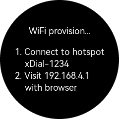

WiFi Provision
======================

The device needs access to network to sync clock and request for weather data.

When wifi is not accessable at startup, the device will enter WiFi provision mode with screen showing below interface.

\ 

Device will provide a WiFi hotspot named "xDial-xxxx", last four digits being device ID.

| Follow the instructions, connect to device's WiFi hotspot with your phone, then you shall see a WiFi provision page pop up (if not, you'll have to visit the IP address with your browser), in which you can type in the WiFi name and password in your home or office.

Then the device will reboot and WiFi configuration will be saved.

.. note::
   It's recommended to bind the device's MAC address to a static IP address. Usually this can be done in the configurtion page of your WiFi router.

.. raw:: html

   

   <b>Video guide</b>
   <iframe src="https://www.bilibili.com/blackboard/html5mobileplayer.html?aid=1252461039&bvid=BV1sJ4m1j7SP&cid=1486040529&p=1&high_quality=1&danmaku=0" scrolling="no" border="0" frameborder="no" framespacing="0" allowfullscreen="true"></iframe>
   
