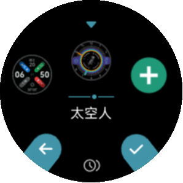
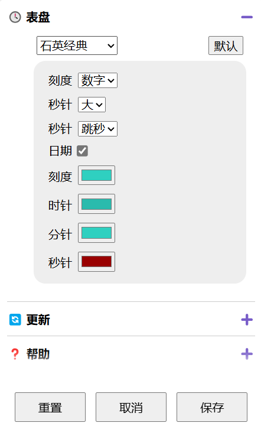
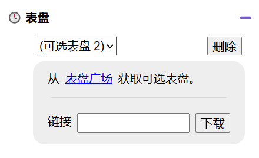
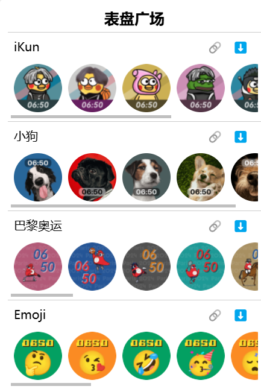

自定义表盘
============

.. figure:: _static/menu_cf.dev.png
   :class: dev

   进入设备的表盘界面

   里面包括几个系统自带的表盘和 3 个可选表盘

系统表盘
----------

系统自带的表盘可以在设置页面中做颜色或样式等简单的自定义，“默认” 按钮则恢复初始设置，点击 “保存” 后生效。

\

可选表盘
----------

可选表盘需要通过下载获得

在 “表盘” 栏的下拉菜单选择的 “可选表盘 N”，点击 “表盘广场” 链接

\

点击相应的主题表盘右侧的 ⬇️ 按钮便可下载

\

.. raw:: html

   

   <b>视频演示</b>
   <iframe src="https://www.bilibili.com/blackboard/html5mobileplayer.html?aid=1206308138&bvid=BV1Sf421q7bu&cid=1628971459&p=1&high_quality=1&danmaku=0" scrolling="no" border="0" frameborder="no" framespacing="0" allowfullscreen="true"></iframe>
   

