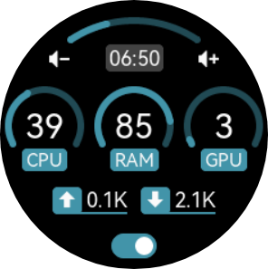

性能监视
===============

设备可作为一个简易的电脑主机性能监视屏，其原理是在主机端运行一个程序，定期获取性能数据并发送给设备用于显示。

   进入设备的性能监视界面

   点击右键 ⊙ 可以开启/关闭性能监视功能

同时，您需要根据主机的操作系统下载并运行对应的程序。

.. toctree::
   :maxdepth: 1

   perfmon_win
   perfmon_gen

.. warning::
   目前刚适配了 Windows 平台，将来会继续完善。

