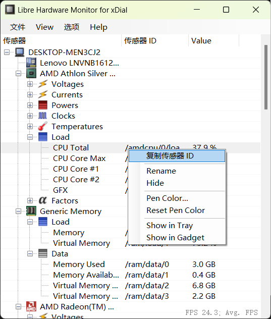
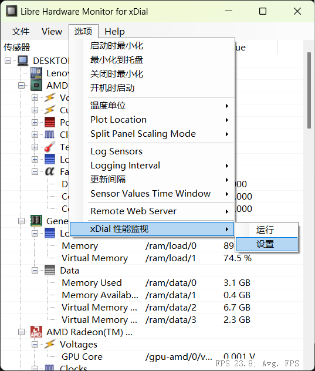
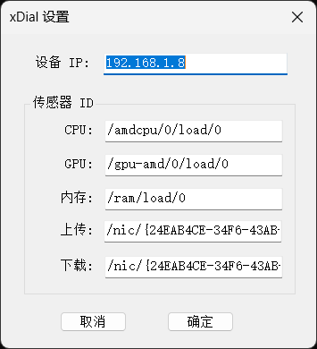
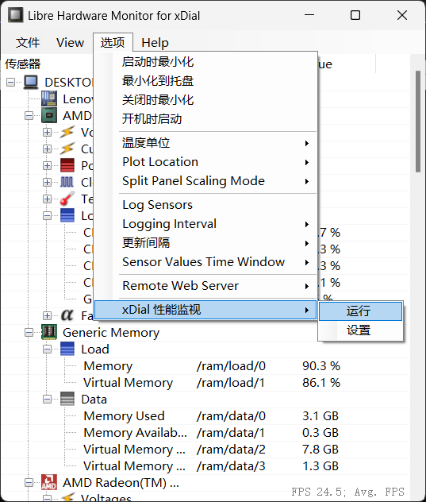

Windows 性能监视
+++++++++++++++++++

下载主机端程序 |LibreHardwareMonitor_for_xDial.zip| ，**全部解压** 后运行 LibreHardwareMonitor_for_xDial.exe（可能需要管理员权限）

\

.. note::
   该软件需要 .NET 4.7.2 或以上版本支持，Windows 7 以及更早的系统可能需要自行 |下载安装 .NET Framework 4.7 Runtime|

目前笔者对该软与 xDial 相关的菜单做了汉化，您可以在软件中看到主机的许多性能指标。您还可以在 *选项* 菜单里选择 *开机启动*、 *最小化到托盘*、*更新间隔* 等。 

找到 CPU 负载（Load → CPU Total）对应的指标，单击右键 → 选择 *复制传感器 ID*

\

点击菜单 *选项* → *xDial 性能监视* → *设置*

\

在对话框中填入 xDial 设备对应的 IP 地址(可在设备的设置界面中查看)、CPU 负载的传感器 ID，以及主机其他各项性能指标对应的 传感器 ID，点击 *确认* 关闭对话框

\

点击菜单 *选项* → *xDial 性能监视* → *运行*，此时软件会尝试连接 xDial 设备。

\

同时，请确保设备的性能监视功能也在开启状态。

.. |LibreHardwareMonitor_for_xDial.zip| raw:: html

   <a href="https://gitee.com/r-cute/LibreHardwareMonitor_for_xDial/releases/latest" target="_blank">LibreHardwareMonitor_for_xDial.zip</a>

.. |下载安装 .NET Framework 4.7 Runtime| raw:: html

   <a href="https://dotnet.microsoft.com/en-us/download/dotnet-framework/net47" target="_blank">下载安装 .NET Framework 4.7 Runtime</a>
