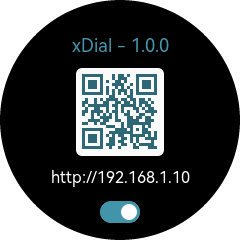

设置
=============

   进入设备的设置界面

   点击右键 ⊙ 可以开启/关闭设置功能

扫描二维码或访问二维码下方的网址，进入网页版设置页面

\

| 在设置页面中点击 “+” 号展开各栏目修改设置。 
| 点击底部 “保存” 按钮后生效，保存之前点击 “取消” 按钮将恢复原有的设置，“重置” 按钮则是恢复出厂设置。

.. tip::
   为方便使用，你可以用手机默认浏览器打开设置页面，然后将其添加到主屏幕