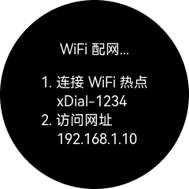

WiFi 配网
==========

设备需要连接网络，以同步时间并获取天气数据。

在设备首次使用，或启动过程中无法连接 WiFi 时，会显示如下配网界面。

   此时设备提供一个 WiFi 热点，名为 “xDial-xxxx”（后四位为设备 ID 号）

| 依照界面中的提示，连接该热点，并在弹出的配网页面中输入您家中或办公环境中的 WiFi 名和密码，点击确定。
| 如果配网页面没有自动弹出，您可以用浏览器访问 WiFi 配网地址。

成功链接 WiFi 后设备会重启并保存 WiFi 配置。

.. tip::
   | 设备的 IP 地址是由 WiFi 路由器分配的，建议在配网完成后为设备绑定一个固定的 IP 地址，这能方便后续网页设置页面的访问以及性能监视功能的使用。
   | 这通常可以在 WiFi 路由器的设置页面中完成。

.. raw:: html

   

   <b>视频演示</b>
   <iframe src="https://www.bilibili.com/blackboard/html5mobileplayer.html?aid=1252461039&bvid=BV1sJ4m1j7SP&cid=1486040529&p=1&high_quality=1&danmaku=0" scrolling="no" border="0" frameborder="no" framespacing="0" allowfullscreen="true"></iframe>
   
